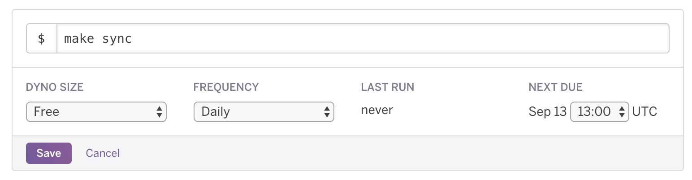

# KNOTS Heroku Recipe

Executes a [KNOTS](https://github.com/singer-io/knots) job on a schedule. It will be executed in [Heroku](https://www.heroku.com/).

## Getting Started

1. Click [here](https://github.com/datadotworld/knots-heroku-recipe/archive/master.zip) to download this repository. Please extract the contents of the ZIP file. Take note of the `knots` folder.
2. Create a new [KNOTS](https://github.com/singer-io/knots) job
3. From the KNOTS home screen, find the job that you wish to automate and click on the `Export` button. You will receive a ZIP file.

4. Drop that ZIP file into the `knots` folder mentioned in Step 1
5. You will need your own [Heroku](https://www.heroku.com) account. The account will need to be
[verified](https://devcenter.heroku.com/articles/account-verification), meaning that you'll need to put in your credit card info, although it's highly unlikely that you'll go past the bounds of the free tier.
6. Click on the `deploy-osx.command` file to begin the deployment
    1. Mid-way through, you will be asked for your Heroku credentials
7. Once deployment is done, you will be presented with the App URL. It will be something like `https://dashboard.heroku.com/apps/gentle-tor-24455`. Please open that URL in your browser to go to the app's 'Overview' page.
8. Under 'Installed add-ons', click on 'Heroku Scheduler'
9. Add a new job. The command to use is `make sync`. Please note that times are in UTC.

As an example, the following job is scheduled to run daily at 8 AM CDT:

### Manual Run

If you ever have a need to update the data immediately, you can trigger a manual update. Click on 'More' on the upper right-hand corner, and then 'Run console' (screenshot below).
Type `make sync` on the screen that pops up and press 'Run'.

### Contributing

This integration has been released as an open-source project. Community participation is encouraged and highly
appreciated. If you'd like to contribute, please follow the [Contributing Guidelines](CONTRIBUTING.md).

### Support

For support, either create a [new issue](https://github.com/datadotworld/knots-heroku-recipe/issues) here on
GitHub, or send an email to help@data.world.
